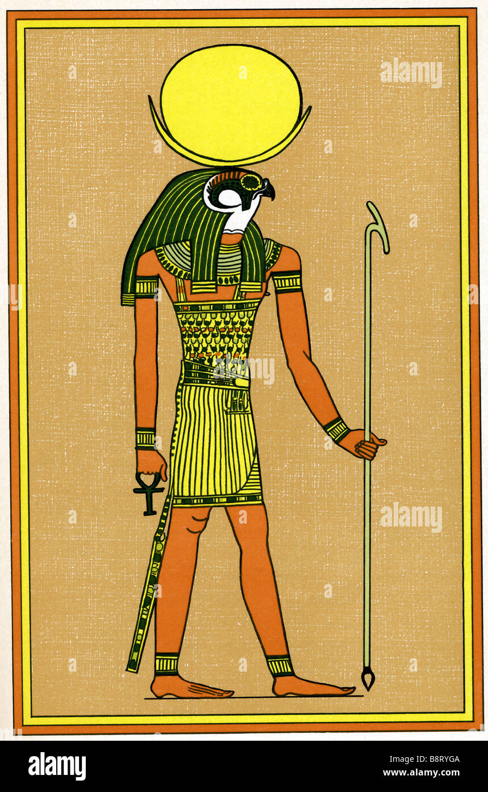
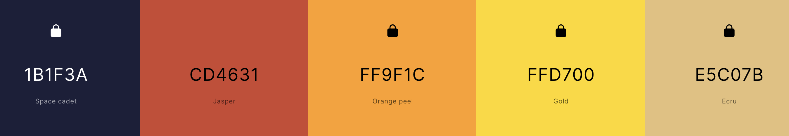
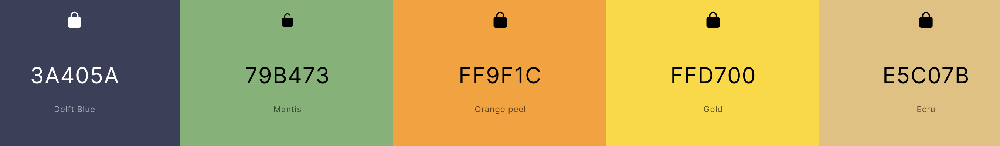
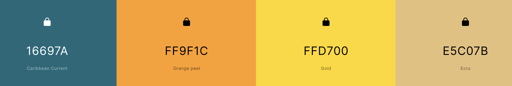
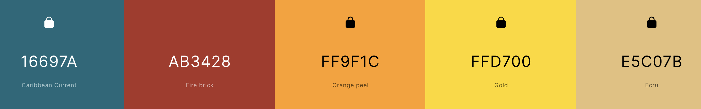
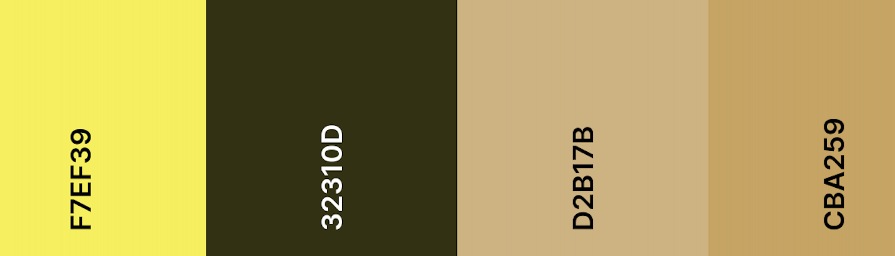
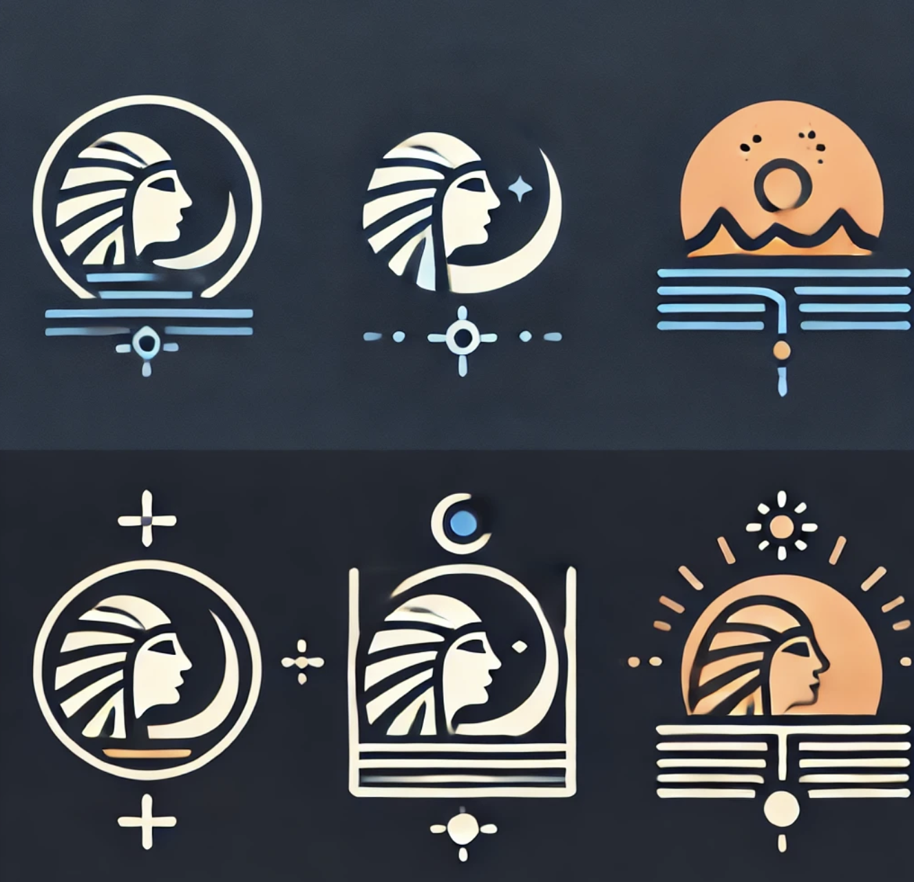

# Branding

- **Name:** Konsu
  - an [ancient Egyptian god](https://en.wikipedia.org/wiki/Ancient_Egyptian_god) of [the Moon](https://en.wikipedia.org/wiki/Lunar_deity). His name means '**traveller**', and this may relate to the perceived nightly travel of the Moon across the sky.
  - He was also portrayed with the head of a [falcon](https://en.wikipedia.org/wiki/Falcon) and like [Horus](https://en.wikipedia.org/wiki/Horus), with whom he is associated as a protector and healer, adorned with the moon disk and crescent moon.
  - god of light in the night, Khonsu was invoked to protect against wild animals, and aid with healing. It was said that when Khonsu caused the crescent moon to shine - **perhaps include moon in design?**
  - Picture inspo
    
- **Colours:** dark blue, orange, yellows, golds - **luxurious yet adventurous**
  
  
  
  
  - Not set on colours yet, will confirm after I make logo
    
    Based on image above
- **Logos:**
  - Logos generated by ChatGPT:
    
    - Potentially like the head, especially incorporating it with the moon. Will change it to be more simple, and some without the complex head and more of a focus on the moon / staff
