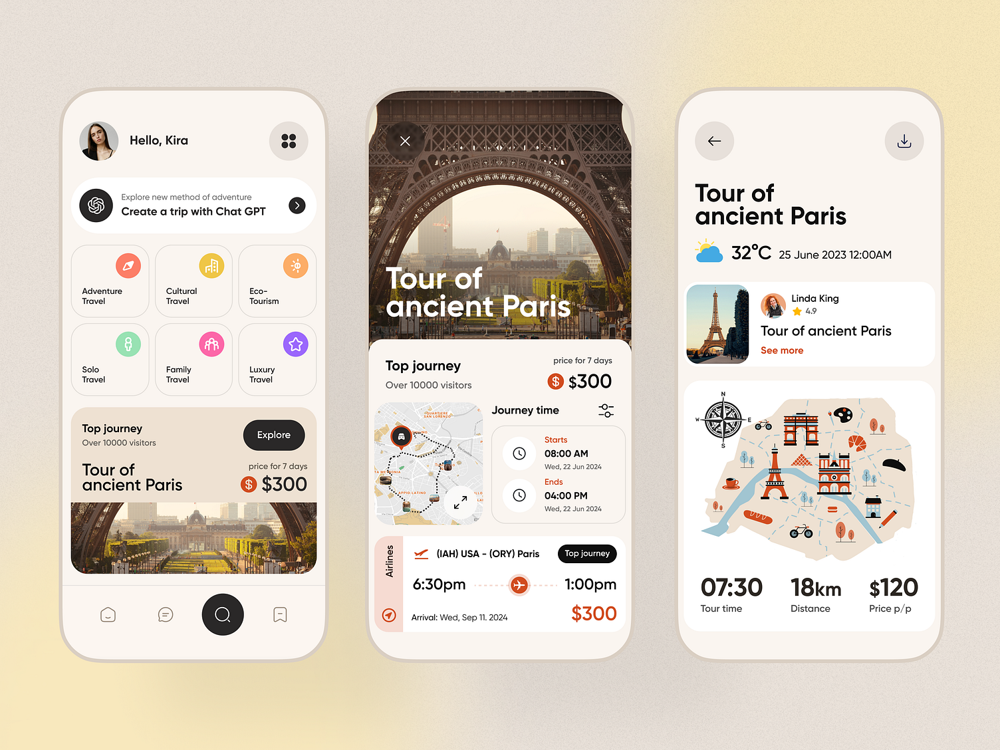

# UI/UX Mood Board

https://dribbble.com/shots/25356817-Travel-Experience-App-Design

https://dribbble.com/shots/25431147-Hiking-Mobile-App-Concept

[https://dribbble.com/shots/23855155-Wayfaro-Trip-planner-travel-deals](https://dribbble.com/shots/23855155-Wayfaro-Trip-planner-travel-deals)

TikTok, for your travel itinerary.

Moods: futuristic, foreign, but also ancient and wise.
