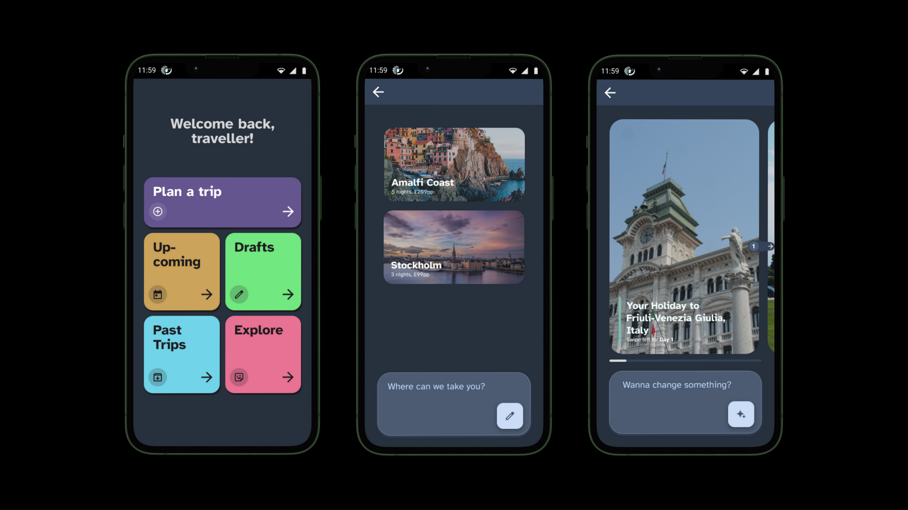

# Konsu

Team:

- Ben Rall (br532)
- Caroline Morton (cm2781)
- Harry Crane (hc2188)
- Harry Turton (at2606)
- Hugo Whittome (hw2210)
- Pal Kerecsenyi (pk760)
- Peter Meiklem (pjm70)
- Sam Ndenecho (sjn53)

# Contents

- [Product](#product)
  - [Problem](#problem)
  - [Solution](#solution)
- [Market](#market)
  - [Secondary Research](#secondary-research)
  - [Stakeholder Research](#stakeholder-research)
  - [Competitor Analysis](#competitor-analysis)
- [Strategy](#strategy)
  - [Business Structure and Team](#business-structure-and-team)
  - [Resources](#resources)
  - [Finance](#finance)
  - [Sales and Marketing](#sales-and-marketing)
  - [Operational Plans](#operational-plans)
  - [Risk Management and Mitigation](#risk-management-and-mitigation)
- [Contributions Split](#contributions-split)
- [Appendix](#appendix)

# Product

### Problem

Planning and managing holidays can be quite the difficult task, from booking flights, hotels, and planning itineraries you can easily become overwhelmed with all the different websites you need to visit. Especially when balancing everyone’s needs and preferences, it can just be too difficult, leading to you potentially just choosing to buy a holiday bundle which has already done all the planning for you. This results in holidays that are subpar and do not personalise to your needs and your wants.

### Solution

We plan to solve this by combining generative AI with industry standard APIs to provide customers with a one-stop shop for all your holiday needs. This will vastly simplify the booking and planning process by doing travel research for our users.

We call this solution Konsu, your own personalised travel agent. This name was chosen as a nod to the Egyptian God of travel “Khonsu”, as we want to reflect on the timeless pleasure of travel.

The primary aim of Konsu will be to reduce the administrative and mental burden associated with planning and booking holidays. Many consumers start the booking process without a specific destination in mind, rather just a general concept of what type of holiday they’re looking for. As a result, Konsu is designed to be creative and adaptive, giving immediate ideas without requiring the user to specify all details.

Traditionally, using a travel agent or booking a package holiday would help fulfil this, but these often give limited options. As time goes on, fewer and fewer travel agents are available and an increasing number of consumers are looking for more “organic” personalised experiences that they can share with friends and family ([https://www.mckinsey.com/capabilities/growth-marketing-and-sales/our-insights/the-value-of-getting-personalization-right-or-wrong-is-multiplying](https://www.mckinsey.com/capabilities/growth-marketing-and-sales/our-insights/the-value-of-getting-personalization-right-or-wrong-is-multiplying)). Konsu will give users the best of both worlds by offering a unique holiday fine-tuned to their suggestions and preferences, with the ease of conversing with a travel agent. The latter point might especially be of benefit to older people or others who may struggle to use regular booking websites. Konsu will even be able to utilise the data of many users to help give recommendations that can push users out of their comfort zone.

### Customers and Konsu’s Benefits

Everyone needs a holiday, from students to workers to parents and even to experienced travellers, Konsu will cater for all while offering a cheaper and easier experience than a travel agent.

For students, they will want a cheap holiday which they can afford on a tight budget, and maybe one they can bring a large group of friends to. But they will want a unique experience, especially those who have just come off a gap year. Konsu will be able to scale down a holiday to make sure a location is picked that can support a large group of students while also having a lot of free, fun activities they can do during the day, or it can make sure there are many nightclubs or pubs within easy walking distance.

For workers, most of their time will be spent earning enough money so that they can afford their holiday, meaning they will not have time to manage or plan the perfect holiday. Again, Konsu will make it so they don’t have to spend their fickle hours in the evening or weekend constantly planning their break, instead they can just click a few buttons and have Konsu generate them a full holiday with a fully planned itinerary. They don’t even need to know when they want to go, only that they want to spend a given amount of holiday days, Konsu will find the most appropriate, that being cheap or maybe even beautiful, time to go.

For parents, they will have to manage both a full-time job and their own children. Trying to plan a holiday on top of this can be a nightmare, with the worry that their children won’t like the experience or making sure a place is child-friendly and will be safe for you to go. Konsu will take this stress away, by accounting for your children’s ages or other factors to make the location and activities as age appropriate for you. Furthermore, it could also suggest a couples’ date night, and find somewhere or someone to entertain your children meanwhile.

For more experienced travellers who enjoy the process of manually researching and selecting their options, Konsu will still provide value by streamlining the search process. Instead of spending hours sifting through countless websites, users can access curated recommendations and direct links to trusted sources, cutting down on research time while still maintaining full control over their itinerary. Moreover, Konsu will be able to seamlessly organise and optimise multi-destination trips, ensuring efficient travel while making the most of both time and budget.

Additionally, more consumers are being conscious of their own impact on the environment and are looking for “greener” options for going on holiday, such as using the train or having domestic holidays. Konsu will be able to manage this, personalising the location and transport to be as low carbon as possible while still offering an outstanding experience.

Lastly: in real life, things don’t always go to plan — places may be closed, there are bad weather days, and transport might be cancelled delayed. Konsu will adapt to last-minute changes; for example, it might recommend a user to visit a museum if the public gardens are closed, or to check out a nearby cathedral whilst they are waiting for their delayed train — sometimes the best things happen accidentally.

### Flow

Most initial interactions with Konsu will be through a simple, linear booking funnel. From a business perspective, the goal is to encourage the full completion of the funnel, ending with a payment and confirmation stage. Step-by-step, the funnel will look like this:

1. The user opens Konsu. Immediately, they are shown a list of fully packaged holiday options. When they first open the app, we will have no knowledge of the user’s preferences. As such, these are initially generated by getting the user’s location from their IP address, and simply choosing the most popular or cheapest destinations based on a range of heuristics.
2. They initiate the booking flow either by selecting from the existing list of options or by asking for further customisation from the chatbot. They can enter their needs in any abstract way, for example by asking for a “beach holiday for a family with 2 children on a tight budget”.
3. Konsu uses industry-standard APIs (for example, the widely used Amadeus API for flights) to find offers, then puts together coherent itineraries including transport and accommodation and finds price estimates. It creates a small number (~5) of ready-made options to various destinations as per the user’s request, and displays them in a neat grid. The user can pick from the suggestions or ask for further refinement simply by interacting with the chatbot. Any numbers, dates, or times quoted will come from Retrieval Augmented Generation powered data extraction, not from the natural language model itself, to avoid hallucinations as much as possible.
4. The user selects an option, and previews the precise details involved in their chosen itinerary. Konsu will show all the transport and accommodation bookings it has planned in a transparent and clear way, and allow the user to ask further questions or request changes (such as, “I’d like to stay in a more child-friendly hotel”).
5. The user provides their payment details, and the Konsu books the entire package in one single step. This may take some time, so the user will be shown engaging content meanwhile (for instance, a reel of the attraction visits Konsu has planned to get them excited about the trip).
6. During the trip, Konsu provides real-time notifications on any alterations or disruptions to the trip, with simple actionable insights. For example, in the event of a flight cancellation, it would show the next available flight that the user can board, and where possible it will automatically reissue their boarding pass. This minimises stress for the user, ensuring they can focus on having a good time.
7. Konsu adapts to any final modifications the user may request. For example, if it’s rainier than expected, they can ask Konsu to suggest more indoor activities such as museum visits, and their schedule will be rearranged accordingly.

### Potential Challenges

- Connecting to APIs and gaining access to the systems needed to book flights and accommodation is a clear possible challenge. However, large common API platforms such as [Amadeus](https://amadeus.com/en/travel-sellers/products/selling-platform-connect) will make this significantly easier with pre-implemented APIs and pre-negotiated agreements with travel providers such as airlines. Many major European rail companies such as Eurostar, SNCF, DB, and SBB have also implemented common API offerings that are now used by traditional flight booking websites like [Kiwi.com](http://kiwi.com/) to supplement flight itineraries with rail connections. [Booking.com](http://booking.com/) and other accommodation aggregators also offer public facing APIs with no barriers to entry. As a result, the technical side of implementing this access appears to be relatively simple, with ready-to-use APIs at every stage of the process.
- Scaling the application to support large numbers of users is also a potential bottleneck. As the app grows, we’ll need resources to support large-scale AI inference and a complex backend that performs many distinct tasks (itinerary construction, billing, authentication, etc.) with various requirements. However, we can mitigate this by using a microservice’s architecture: each component of the app’s backend will be hosted separately on horizontally scalable resources (for instance through a Kubernetes cluster).

# Market

### Secondary Research

Before moving forward with Konsu, we needed to ensure there was strong demand for our product and that it addressed real customer needs. In a recent survey of 1000 travellers by the Matador Network ([https://guidegeek.com/press/use-of-ai-tools-for-travel-up-40-in-past-year](https://guidegeek.com/press/use-of-ai-tools-for-travel-up-40-in-past-year)), more than 1 in 5 (22.8%) said they have used artificial intelligence to plan or assist with travel, which represents more than a 40% increase since the previous year. Beyond that, more than one third (34.4%) of participants claimed that they were likely to use AI to plan or assist with their upcoming travel plans. With an estimated 1.4 billion international tourists recorded around the world in 2024 ([https://www.unwto.org/un-tourism-world-tourism-barometer-data](https://www.unwto.org/un-tourism-world-tourism-barometer-data)), this presents us with a huge possible user base that will only continue to grow as AI becomes more readily accepted by consumers.

Additionally, the global online travel booking market is experiencing significant growth, with projections indicating it will reach $1589.6 billion by 2032, growing at a compound annual growth rate of 12.6% ([https://www.globenewswire.com/news-release/2024/02/27/2836145/0/en/Latest-Global-Online-Travel-Booking-Market-Size-Share-Worth-USD-1589-6-Billion-by-2032-at-a-12-6-CAGR-Custom-Market-Insights-Analysis-Outlook-Leaders-Report-Trends-Forecast-Segment.html](https://www.globenewswire.com/news-release/2024/02/27/2836145/0/en/Latest-Global-Online-Travel-Booking-Market-Size-Share-Worth-USD-1589-6-Billion-by-2032-at-a-12-6-CAGR-Custom-Market-Insights-Analysis-Outlook-Leaders-Report-Trends-Forecast-Segment.html)). This proves that consumers are moving away from traditional travel agencies in favour of digital solutions that streamline the planning and booking process for them, and Konsu is perfectly positioned to capture this growing market. By integrating AI into an intuitive interface, Konsu will capitalise on both the convenience of digital travel booking and the increasing trust in AI-driven recommendations.

Building upon this, consumers today expect personalised experiences in nearly every aspect of their online interactions, and travel is no exception. According to a study by Epsilon, 80% of consumers are more likely to make a purchase when brands offer personalised experiences ([https://www.epsilon.com/us/about-us/pressroom/new-epsilon-research-indicates-80-of-consumers-are-more-likely-to-make-a-purchase-when-brands-offer-personalized-experiences](https://www.epsilon.com/us/about-us/pressroom/new-epsilon-research-indicates-80-of-consumers-are-more-likely-to-make-a-purchase-when-brands-offer-personalized-experiences)), and research by McKinsey found that businesses excelling in personalisation generate 40% more revenue than their competitors, proving that tailoring services to individual customer needs is a key driver of success ([https://www.mckinsey.com/capabilities/growth-marketing-and-sales/our-insights/the-value-of-getting-personalization-right-or-wrong-is-multiplying](https://www.mckinsey.com/capabilities/growth-marketing-and-sales/our-insights/the-value-of-getting-personalization-right-or-wrong-is-multiplying)). Konsu’s AI-driven approach is specifically designed to meet this rising demand for personalisation. Traditional travel websites such as [Booking.com](http://booking.com/) or Expedia simply present the user with a list of viable options, which lacks a personal feel and requires more manual searching, whereas Konsu will instantly tailor its recommendations based on personalised interaction with the consumer through the chat interface. Additionally, the ability to quickly refine suggestions based on further inputs and information aligns with these industry trends, which will make Konsu a strong solution to this growing consumer expectation.

Another way in which consumer behaviour in travel planning has changed significantly in recent years is the shift to travellers seeking inspiration before choosing a destination. [Booking.com](http://booking.com/) found that 57% of US travellers begin their trip planning without a specific location in mind and instead focus on the experiences they want to have ([https://news.booking.com/how-bookingcoms-ai-trip-planner-can-inspire-travelers-to-plan-that-last-minute-summer-vacation/](https://news.booking.com/how-bookingcoms-ai-trip-planner-can-inspire-travelers-to-plan-that-last-minute-summer-vacation/)). Similarly, Expedia Group research indicates that 59% of travellers do not start with a set destination and explore multiple destinations before making a final decision ([https://advertising.expedia.com/blog/travel-trends/travel-research-process-and-destination-decisions/](https://advertising.expedia.com/blog/travel-trends/travel-research-process-and-destination-decisions/)). Konsu will directly address this trend by eliminating the need for users to enter a specific destination when starting their travel search. Instead, Konsu will be able to consider general travelling experiences and goals and then provide several possible locations and itineraries for users to browse through. This increases the likelihood of users finding a trip plan that meets all their goals, independent of specific location, which in turn would result in a higher rate of booking completion through our service.

However, despite all this promising research, the travel planning market is becoming increasingly saturated, making it more difficult for new entrants to differentiate themselves. As noted by Business of Apps, the travel app market generated $629 billion in revenue last year, a 13% increase from the previous year ([https://www.businessofapps.com/data/travel-app-market/](https://www.businessofapps.com/data/travel-app-market/)). This growth has attracted many players, with more travel apps vying for consumer attention than ever before. This poses a significant challenge, and makes having a clear and desirable unique selling proposition, driven by stakeholder research and competitor analysis, essential.

### Stakeholder Research

To further develop the idea for our product and ensure it would quickly meet a Product-Market Fit as close to its launch as possible, we decided to engage directly with potential end-users of the app and examine their travel habits, preferences, and reactions to proposed app features. Younger people are more likely to adopt new technologies ([https://academic.oup.com/innovateage/article/1/suppl_1/1026/3900859?login=false](https://academic.oup.com/innovateage/article/1/suppl_1/1026/3900859?login=false)) — Konsu will undoubtedly offer a very different understanding model compared to other pre-existing travel booking services, so an open and ready audience is required to kick-start its adoption. As a result, we decided to target university-age students as our primary user group.

We created a short stakeholder survey to gain a basic comprehension of how users would be impacted by our app’s offering. We used a range of methods to distribute the survey, including directly reaching out to stakeholders as well as sending messages on popular group chats. In the survey, we began by asking a few demographic identifier questions, ensuring to keep them privacy-preserving by asking for ranges (for example net income of £31-50k) instead of specific values. Responses were completely anonymous, and the data was stored securely, maintaining the university’s ethics requirements.

Following these questions, we asked users to rank their perceived importance of certain features on a 0-10 scale, with 0 being “Unimportant” and 10 being “Important”. This helped us gain a more nuanced understanding of their requirements, rather than just an overall score for the entire concept. It will also help us create a prioritised backlog of features to implement, by focusing on the “dealbreaker” features above more niche ones. The field Konsu will operate in is highly competitive, so a fast development plan with effective time-management is key.

The survey received nine responses, all of them from respondents aged between 16 and 22, so preserving the target audience as defined above. Although the sample size is small, it does effectively demonstrate consistent and insightful opinions on the idea of Konsu and has helped us more clearly define the product. Roughly half of the respondents were male and half female, with a mix of different income levels (with higher incomes potentially reflecting students who are on a placement year).

Overall, respondents said were likely to download the app should they be presented with it, with eight out of nine responding with a five or above to that question (on a 0-10 scale). Most users said they’d only be infrequent users once they had downloaded it, but this is also potentially explainable: there’s only a need to use Konsu when booking a holiday or trip, which is an infrequent occurrence for most people. The mean results for each of the specific features are as follows:

- AI-personalised travel packages based on your preferences: 6.33
- Being able to pay for a complete package in one transaction: 7.44
- Real-time trip updates (e.g. based on the weather) and being able to rearrange your plans: 8.56
- A page that shows your itinerary and directions on a map of the city: 7.78

As shown, users ranked all four features quite highly, clearly emphasising the importance of Konsu overall. Some features were ranked higher than others: for instance, real-time trip updates over AI-personalised travel packages. Potentially, this could be explained by a lack of pre-existing exposure to the application of AI technologies to the travel experience. It’s important for Konsu to gain users’ trust, and a simple survey would likely not have been sufficient. Moreover, respondents may have considered other features beyond the first one as “dependent”: real-time trip updates cannot exist without Konsu having organised and arranged the trip for you, and as such respondents may have scored the feature relative to the assumption of them already using the app, rather than just how much value that feature would add to their lives independently.

That being said, it’s clear that real-time trip updates are essential to all respondents, and as such will be made a priority to implement. At first glance, it had seemed like a niche feature to our team: helpful, but not essential. However, based on stakeholder engagement, we have redefined its value and therefore rearranged our plans for development, further ensuring our product’s competitive success.

Additionally, following this survey, we had the opportunity to present our product to a group of students in person to gather feedback and address their questions. This session provided valuable insights, reinforcing strong interest in Konsu and its potential for success, as the feedback was overwhelmingly positive, with participants expressing enthusiasm for the app’s unique approach to travel planning. The primary constructive criticism received concerned Konsu’s current logo, with some noting its resemblance to the Starbucks logo. This is an important consideration as we finalise the branding to ensure Konsu has a distinctive and recognisable identity before launch.

### Competitor Analysis

To position Konsu effectively within the market, we conducted a thorough competitor analysis to identify key gaps, strengths, and weaknesses among existing travel planning and booking solutions. This analysis allowed us to refine Konsu’s unique selling proposition (USP) and ensure that our product will deliver the most key features and a superior user experience.

We first evaluated traditional travel booking platforms, such as [Booking.com](http://booking.com/) and Expedia ([https://www.expedia.co.uk/](https://www.expedia.co.uk/)), which dominate the market by offering direct booking for flights and accommodation. Their strengths include their wide variety of options and the quantity of useful information provided to the user (including real-time availability, information on accommodation facilities, user reviews, and exclusive discounts). However, they lack personalised recommendations and adaptability: users must manually search and piece together their plans. This process can be gruelling and time-consuming, especially for longer, multi-destination trips. They also rely on users already having a destination in mind, failing to align with the shift in consumer behaviour toward experience-based trip planning. We aim to address these core issues through Konsu’s AI-driven itinerary creation, which will dynamically adapt to user preferences and requirements. On top of this, we intend to integrate [Booking.com](http://booking.com/)’s APIs to provide the user with the same level of detailed information and booking convenience as these traditional platforms. This combination of AI-powered insights with the proven strengths of established platforms forms the foundation of Konsu’s unique selling proposition: personalised, end-to-end trip planning in a single platform.

Following this initial analysis, we evaluated more direct competitors to Konsu – platforms that utilise AI to offer more personalised travel experiences. Many of the competitors we evaluated that advertised themselves as AI trip planners just consisted of a simple interface where one could input a trip’s location, duration, and some generic preference options, and would then provide you with an AI-generated itinerary. Though they lack many of the key features we wish to include, such as experience-based planning and trip booking, there are still many strengths exhibited that are worth noting for inclusion in Konsu. For instance, one site called TravelPal ([https://travel-pal.netlify.app](https://travel-pal.netlify.app/)) provided lots of extra information about the chosen travel destination, including information about required vaccines, the expected weather for the chosen period, the types of electrical sockets, and more. These are incredibly useful details to consider when planning a trip, especially if generating a trip to a location that you’re unfamiliar with, which would often be the case with Konsu when having new places suggested for you based on desired experiences.

Several sites such as Plantrip ([https://plantrip.io](https://plantrip.io/)) and another also called TravelPal ([https://www.travelpal.ai](https://www.travelpal.ai/))/) provided a view similar to Google Maps to show various activities from the itinerary and the routes between them. We believe this is a great design choice, and makes the process of reviewing and refining an itinerary much more visual and streamlined. One particularly strong site we found was EasyTrip AI ([https://app.easytrip.ai](https://app.easytrip.ai/)), which provides an extremely detailed itinerary, with lots of information about each activity and links to allow you to research choices yourself further. An important additional feature provided by EasyTrip AI is the ability to see alternatives for each section of the itinerary, allowing the user to easily select what they prefer. This is very valuable for giving a greater level of personalisation while still not requiring the user to manually search for alternative activities. However, we found that EasyTrip AI was still lacking in many ways. Although it gives you links to book ticketed activities, it cannot book them for you, which leads to extra hassle for the user. It also has very limited options when specifying your interests, which was a common issue among many of the similar competitors we evaluated, and one of the key things we wish to overcome with Konsu’s use of a large language model to learn and store the user’s interests.

We identified one example of a large language model being currently used for travel planning in [Booking.com](http://booking.com/)’s own AI trip planner ([https://news.booking.com/bookingcom-launches-new-ai-trip-planner-to-enhance-travel-planning-experience/](https://news.booking.com/bookingcom-launches-new-ai-trip-planner-to-enhance-travel-planning-experience/)). From this, the benefits of using an LLM were made even more obvious to us – the conversational feel of the booking process is very natural and straightforward, while also being more personalised as it allows you to describe your specific interests to a greater capacity without being limited to a list of options. The trip planner can find flights and accommodation, but also suggest locations and itineraries, giving the ability for experience-based planning that we want to replicate with Konsu. Furthermore, as it’s directly integrated with [Booking.com](http://booking.com/)’s interface, it can reserve accommodations for you automatically. This is still limited as it does not extend to activities and flights, but it gives a good idea of the usefulness of having the travel planning experience be entirely contained in one platform. Additionally, the planner does not store personal preferences, meaning a user would have to explicitly repeat them each time they want to make a booking, and though it can give you ideas for an itinerary, it’s fairly limited, not providing many details about activities or showing them on a map.

For final insights, we researched into Expedia’s travel planner “Romie” ([https://www.expedia.com/newsroom/spring-product-release-2024/](https://www.expedia.com/newsroom/spring-product-release-2024/)), which was announced almost a year ago but is still yet to be launched. Despite this, there are still valuable takeaways from the proposed features described by Expedia. The primary uniqueness of Romie would have been that you can interact with it by adding it to an SMS group chat, and then message it to get personalised suggestions about holiday plans. Expedia claims that it would be able to learn your personal preferences and use them to filter Expedia search results for a trip, and unlike [Booking.com](http://booking.com/)’s AI trip planner, would also remember these details to get progressively more intelligent. They also describe planned dynamic service features, including the ability to monitor weather changes or last-minute disruptions that may impact your plans and then both notify you and provide alternatives. Unlike Konsu, Romie would be more of an add-on to Experia than a standalone platform, and would also only provide suggestions and do nothing more. Even so, the dynamic service and ability to remember preferences are features that should be present in Konsu, as they are core to the experience we want our users to have.

All in all, this competitor analysis reveals the distinctiveness of Konsu. Some features, such as the ability to plan a trip with multiple different destinations, were not present in any of the competitors we evaluated, and though many of our other proposed features have been used in or influenced by existing platforms, we could not find anything that integrates them into one entirely self-contained trip planning process. By combining the use of LLMs for experience-based planning and suggestions based on user preferences with a detailed itinerary planner and integrated booking, we will provide travellers with a uniquely seamless experience, built to meet every one of their needs.

# Strategy

### Business Structure and Team

We plan to make our company a for profit, general partnership where all members have equal ownership and stake. This will keep the structure simple and focus our team on development.

At the core of our strategy is a lean, agile team that blends leadership, technical expertise, and strategic vision. By capitalising on the skills of our members, we keep overheads low while driving rapid product development and market entry. Every team member has a vested interest in the company’s success, contributing not only their expertise but also personal resources to jumpstart our operations.

For leadership, Caroline has been voted in as CEO, and Director. As CEO, she will manage the overall vision and drive key investor relations alongside Pal, our CFO. Pal will also be overseeing and managing our finances, making sure we do not go into debt. As for marketing, we have Peter, our Marketing Director, who in charge of creating a strategy to drive users to our product and start to bringing in revenue for the company.

For operations, we have Ben, our COO, who will be translating strategic objectives into actionable plans, focusing on the non-technical side. For the technical side, we have Sam, our CTO, and Scrum Master, who will be coordinating and managing the team of developers including Hugo, Senior Engineer; Harry Crane, Lead AI Engineer; Harry Turton, Junior AI Engineer. This team will be the core development, focusing on creating an MVP to bring to the market as quickly as possible.

### Resources

To propel Konsu into the mainstream, a multitude of resources will be required. These resources have been split into three different categories: people, management and service.

The first of these is the people, which includes the talent or employees of the company. We will not be employing any new employees, allowing us to move fast and develop a product with low cost. Once we have started to gain income, we can then refocus and employ more people to propel the company to develop even more features within the product. Continuing on the trend of keeping costs low, we will also be using personal laptops, computers, and Wi-Fi to initially develop and communicate, though this will need to be re-evaluated for security reasons once the company has started to get some funding or income. Finally, to establish communication between our team, we will use Slack to allow us to have multiple “channels” focusing on different aspects of the company, such as frontend, backend, and AI development.

Next is management software, which is all the software we need to run the company, but not the service itself. This includes design and marketing software, for which we will be using Figma (which has a free tier we can use) as well as Google and Facebook Ads to help entice new users — these will be funded by our seed funding as we will mention later. Furthermore, for development, we will be using GitHub and VSCode (both free), helping us to collaborate and track features and issues with the product. GitHub will also be used for assigning more general tasks with running the company, keeping tasks contained in one location, making it easier to stay organized and manage assignments. Finally, for income management, we will initially be tracking our expenses in Google Sheets with a combination of Python scripts to make it easier for calculating and submitting tax reports when this is required.

Finally, we have the resources required to run Konsu. This includes the servers which we will be using, which includes AWS and GitHub Static Pages. Although AWS does cost money, we believe we can use their free trials for services to keep costs low until we make an income. Next we will also need a payment management system, which we have chosen to use Stripe which makes it easy to manage income from multiple currencies as well as linking that up with our service — this also works on a per payment charging mechanism; therefore there is no upfront cost to using this system. The main cost of the services will be going towards APIs for AI software. Yet, it has been noted that DeepSeek has recently been released, allowing us to set up a server and run the model on our own hardware (for example a Mac Mini), which can be covered by our initial seed funding. Finally, we will also need a domain for our consumers to find us, which will be covered by our seed funding too.

### Finance

As noted in the resources, we are looking to keep costs as low as possible during development, allowing us to focus on building a product instead of requiring investors before we have proven the product is possible. This will lead to a firm, sustainable foundation from which the company will flourish. Nonetheless, to develop this product quickly, we also want to have our team focus on building Konsu full-time, and so we must balance both efficiency and allow us to pay our team members.

Firstly, we will get an initial bit of money via seed funding. This will consist of all the members of the team contributing their own money to the company to help pay for the cost of initial resources including a domain, a powerful computer to run our AI models as well as our initial budget for advertising. We have agreed to contribute £150 each towards this fund, which includes the £10 from our coursework. This will cover all these initial costs, but won’t be able to pay for our team members, who will have to find a separate income stream to begin with (such as working part-time). During initial development, however, we plan to try to increase our seed funding through angel investors, with Caroline, our CEO, and Pal, our CFO, spending most of their time pitching to potential sponsors. This could lead to our team having to invest more of their money in the project to show how serious we are about creating this product — ultimately, we will leave Caroline and Pal to discuss this with investors.

Once we have created and released an MVP with some traction in the market, we can run a Series A investment. With an MVP released, we can also shift our heavy focus on development to investment, allowing us to assign more people to find investors as well as invite our angel investors to contribute more money to the project. Our plan is to have some initial user base to show investors that people are interested in the project, which hopefully will be an incentive due to the high potential for return on their investment. With this money, we will then be able to keep paying our team for a few years while we bring our product to the mainstream and get a continuous revenue stream. We can then also consider employing more developers to bring more features to Konsu.

In combination to this, while developing, we can also look into alternative funding. We will mostly focus on applying for government grants, which can again go towards paying our team members. From our initial research, we have discovered that we potentially could be eligible for the following grants from the UK government:

- Flexible AI Upskilling Fund pilot (up to £2,500 per employee) — Allowing us to dedicate resources to training our developers to develop better AI
- Better Business Finance (up to £20,000,000)
- Innovate UK Business Growth
- Enterprise programme for young people UK (from £500 to £25,000) — This comes with the requirement that we must have graduated less than 6 months ago, but we can revisit this once we have graduated from university

All of these funds can help fast track our product to release by allowing us to support our members to focus on the project full-time.

### Sales and Marketing

Our revenue model will be built on multiple streams, combining affiliate commissions from hotels, flights, and activities with a direct service fee. Additionally, we will form partnerships with travel brands for sponsored placements and promotions, giving priority to select flights, hotels, and experiences in exchange for recurring payments. Brands will also have the opportunity to earn a “Konsu Approved” badge for a monthly fee, enhancing their credibility among our users.

A key differentiator will be our Dream Holiday Lottery system, which will offer users an exciting way to engage with our platform. Users will be able to create their ideal trip within a set budget, and at the end of the planning process are invited to pay a small entry fee to participate in a monthly lottery. One lucky winner each month will have their dream trip funded, with the prize pool determined by the number of entrants in the previous cycle. This gamified approach not only creates an additional revenue stream but also increases user engagement and retention.

Beyond its entertainment value, this system also serves as a powerful marketing tool, increasing interaction with our AI platform while gathering valuable data on travel preferences. This data will enable more personalised recommendations and targeted marketing. To further boost conversions, we will offer small consolation prizes, such as booking discounts or exclusive travel guides, to non-winners, ensuring continued user engagement.

To further encourage repeat usage and organic growth, we will introduce a referral program that rewards users with travel credits or discounts when they invite friends to the platform. Additionally, a loyalty rewards system allows frequent users to accumulate points, which can be redeemed for discounts, upgrades, or exclusive travel perks, enhancing customer retention and long-term engagement.

Our digital marketing efforts will leverage highly targeted ads on Google and Meta platforms, focusing on key travel-related search terms like “best AI travel planner” and “cheapest way to book flights.” AI-powered retargeting strategies will allow us to re-engage users who previously interacted with the platform but did not complete a booking. Additionally, we will optimise for AI search engines, refining our prompt engineering techniques to ensure Konsu is favourably ranked and recommended within AI-generated search results.

Finally, to establish a strong presence in the travel industry, we will partner with travel and lifestyle influences who have highly engaged audiences seeking unique travel experiences. Our primary focus will be on visual-first platforms like Instagram, TikTok, and YouTube, where travel inspiration thrives. Through these partnerships, we will develop sponsored content, including travel vlogs, comparisons such as “AI vs. Human Travel Agent,” and AI-generated itinerary reviews.

### Operational Plans

Our operating strategy is designed to ensure the efficient development, launch, and scaling of Konsu while maintaining agility and responsiveness to market dynamics. We have structured our approach into four key phases, each tailored to the current stage of the company’s growth.

#### Phase 1: Pre-Launch (Months 1-3)

In the initial phase, our primary focus will be on finalising core team roles and establishing clear communication protocols. We will leverage existing tools such as Slack for internal collaboration and GitHub for project management to ensure transparency and alignment.

To minimise upfront costs, we will use personal equipment and leverage free-tier software solutions wherever possible. Initial funding will be secured through team contributions, covering essential expenses such as domain registration and basic infrastructure setup. Any additional funding requirements will be addressed through targeted outreach to potential angel investors.

Development efforts during this phase will focus on building a minimum viable product (MVP) with core functionalities that demonstrate the potential of Konsu’s AI-driven travel planning. Rigorous testing will be conducted to ensure product stability, while the marketing team will work on establishing a preliminary digital presence through social media and a landing page.

#### Phase 2: MVP Launch and Early Traction (Months 4-6)

Upon completing the MVP, we will initiate a controlled rollout to gather user feedback and validate core features. This beta phase will help us identify areas for improvement while generating early traction.

Our marketing efforts will be geared towards digital advertising and leveraging key partnerships with travel influencers to amplify awareness. By creating engaging content and fostering community interaction, we aim to build a loyal user base from the outset.

Simultaneously, we will pursue funding opportunities through angel investors and grants, leveraging the initial user response and traction as key selling points. Maintaining financial prudence will remain a priority, with expenditure tightly controlled to maximise runway.

#### Phase 3: Post-MVP Growth and Scaling (Months 7-12)

Following the MVP launch, our focus will shift to product optimisation and feature expansion based on user insights. We will implement iterative updates to improve usability and functionality, incorporating enhancements to our AI models to deliver increasingly personalised travel recommendations.

Revenue generation will commence with the introduction of the Dream Holiday Raffle System, affiliate partnerships, and strategic brand collaborations. We will also explore opportunities to monetise through premium features and subscription-based services, ensuring a diversified income stream.

As the platform gains traction, we will carefully scale our technical team to support feature development and maintenance. Dedicated HR functions will be introduced to facilitate recruitment and support team well-being, laying the groundwork for long-term organisational stability.

#### Phase 4: Series A Investment and Market Expansion (Months 12-24)

With a proven MVP and established user base, we will actively pursue Series A investment to secure the financial resources needed for accelerated growth. Our focus will be on scaling operations, enhancing the platform’s capabilities, and broadening our market reach through targeted campaigns.

To reinforce Konsu’s position as an industry leader, we will execute a comprehensive public relations strategy, including participation in high-profile travel and AI conferences. Strategic media engagements and thought leadership initiatives will strengthen our brand presence and credibility.

Operationally, we will enhance our financial management systems to accommodate increasing complexity and ensure rigorous financial oversight. By continually assessing our revenue model and exploring innovative funding avenues, we aim to maintain financial stability while delivering sustained growth.

### Risk Management and Mitigation

While launching Konsu, we have identified and plan to mitigate the key risks that could hinder our success. While the concept of an AI-powered travel planning app offers significant potential, various challenges may arise in areas such as market fit, competition, finances, technology, and regulatory compliance.

### Business Idea and Market Fit Risk

The biggest risk is that the value proposition may not resonate with enough customers. Although the plan is built on trends like AI personalization and on-the-go travel updates, there’s a possibility that the current market does not find these features compelling enough to switch from established booking methods. With only a small initial survey and a focus on university-age users, the broader appeal and willingness to pay for such a service might be overestimated.

To mitigate these issues, we will:

- Use an iterative product development by continuously collecting and analysing customer feedback to fine-tune the offering. If the initial value proposition is not compelling, we will consider pivoting or adding features that address unfulfilled needs.
- Run A/B tests and pilot launches in varied demographic segments to validate demand and adjust the product to better meet market expectations.
- Maintain an adaptable strategy that can shift the target market or modify features based on ongoing customer insights.

### Competitive Risk

The travel tech market is highly competitive, with well-funded rivals like [Booking.com](http://booking.com/) and Expedia who can quickly integrate similar AI-driven features. The ease with which digital platforms can adopt new technologies means that even a unique, first-mover advantage might be short-lived if competitors replicate key functionalities.

To mitigate these issues, we will:

- Develop strong brand loyalty by offering a seamless, personalised experience and by highlighting exclusive features (such as real-time trip updates and the Dream Holiday Lottery).
- Create value that’s difficult to replicate by bundling features that encourage customer retention (for example loyalty programs and referral rewards) so that switching costs are higher.
- Invest in R&D to maintain a technological edge, ensuring that the product stays ahead of competitor's innovations.

### Financial Risk

Operating with a lean, seed-funded team poses a risk of insufficient funds. Unexpected expenses — such as infrastructure scaling, development setbacks, or rising costs for AI APIs — could derail the project. Moreover, if the product doesn’t achieve a rapid uptake, the initial investment might not cover long-term operational expenses.

To mitigate these issues, we will:

- Develop a detailed financial plan that includes contingency funds for unforeseen expenses.
- Explore additional revenue sources such as government grants, angel investors, or even early customer subscriptions to cushion against cash flow issues.
- Prioritise development milestones so that funds are allocated efficiently, allowing for measurable progress before larger investments.

### Technology and Operational Risks

The reliance on AI for personalised travel planning means that any shortcomings in the technology (such as inaccurate recommendations or system downtime) could quickly erode customer trust. Additionally, with a small core team, operational bottlenecks might emerge during rapid growth or in the face of technical challenges.

To mitigate these issues, we will:

- Invest in thorough testing of AI algorithms and system integrations. Rapidly address any issues related to real-time updates or data accuracy.
- Leverage scalable cloud services and adopt agile development practices to handle operational demands as the user base grows.
- Plan for phased team expansion or consider partnering with external specialists for critical functions, ensuring that a lean team does not become a limiting factor.

### Regulatory and Data Privacy Risks

Handling user data and travel preferences introduces compliance and privacy challenges. Any breach or non-compliance with data protection regulations could lead to legal issues and loss of customer trust.

To mitigate these issues, we will:

- Implement robust data protection policies that align with relevant regulations (for example, GDPR).
- Allocate resources to secure systems and regular audits, ensuring data integrity and customer confidence.
- Clearly communicate data usage and protection measures to users, building trust through accountability.

# Contributions Split

Please see our [Group Contribution Form for this coursework `./gcf.pdf`](./gcf.pdf).

# Appendix

Please see our [Appendix folder `./appendix`](./appendix).
